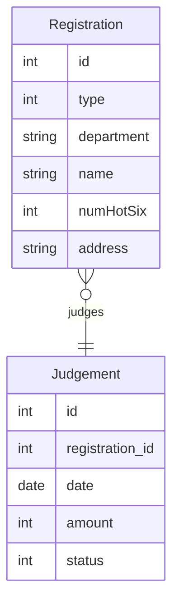
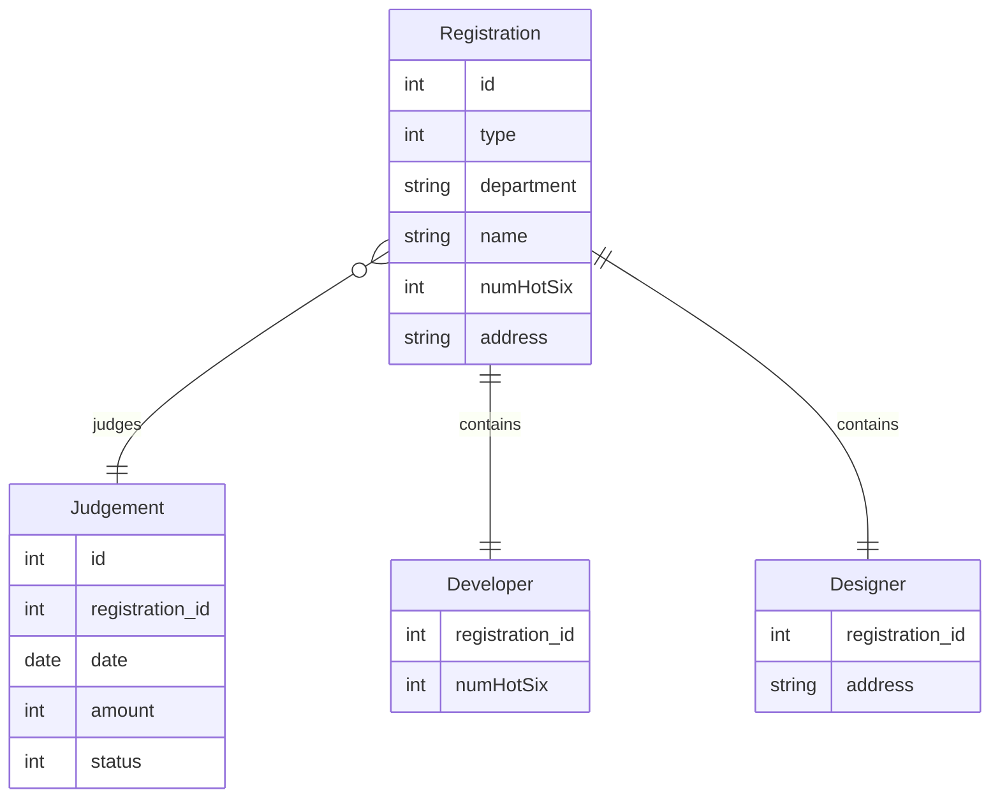

해당 글은 SW개발병으로 근무하면서 리팩토링 했던 내용을 재구성한 글입니다.

# 기존 상황
이 WAS는 어떤 기업의 산재 보상 신청 웹사이트이다.

해당 웹사이트에 보상을 신청하는 사람은 `developer`와 `designer` 2종류가 있다.

`developer`와 `designer`는 같은 회사에서 근무하기 때문에 보상 신청 시 `접수번호`, `소속`, `이름` 등의 공통적인 양식이 존재하며, 서로 다른 직종이기에 추가적으로 입력해야 하는 양식이 다르다. `developer`는 `마신 핫식스 개수`를 입력해야 하고, `designer`는 `주소`를 입력해야 한다.
> 구현 편의상 소속과 이름은 중복되지 않는다고 가정한다.

기존 웹사이트는 `registration`이라는 하나의 테이블에 `developer`든 `designer`든 상관하지 않고 데이터를 집어 넣었다. 그래서 `registration`에는 `접수번호`, `소속`, `이름`, `마신 핫식스 개수`, `주소`, 그리고 해당 데이터가 `developer`인지 `designer`인지 구분하기 위한 `분류` column이 있는 상황이다.

추가적으로 보상을 처리하기 위해 한 달마다 심사가 열린다. `judgement` 테이블이 있으며, `심사날짜`, 해당 심사에 속한 `접수번호`들, `처리 현황`, `보상 금액` colulmn이 있다.

지금까지 table 구성은 아래와 같다.

아래는 이렇게 만들어진 소스코드이다. 도메인형 패키징으로 구현했다. [링크]()

실제 구현은 전체 목록 페이징, 목록에서 검색 등 여러 기능이 있지만 구현 편의상 해당 기능은 포함하지 않았다. 또한 모든 데이터가 DB에 있다는 전제 하에 CRUD 중 Read만 할 수 있다.

기존에 구현되어 있던 기능은 크게 3가지이다.
 - 접수 내용 보기 : 접수번호, 신청자 부서, 신청자 이름, 신청자 직종, 직종에 따른 추가정보(마신 핫식스 개수 또는 주소)
 - 특정 심사에 속한 모든 심사현황 보기 : 접수번호, 처리 현황, 보상 금액
 - 특정 심사에 속한 직종별 보상 처리 현황 통계 보기 : 보상금액, 처리 현황 총계

# 개선 요구
어느 날 산재 처리 담당자가 일하기 너무 힘들어서 분류별로 페이지를 따로 만들어 달라는 요청을 했다. 이제부터 리팩토링을 진행한다.

기존 ERD는 하나의 superclass에 모든 값이 통일된 상태였다. 이렇게 짜여져 있으면 DB의 모든 row가 필요없는 정보를 하나씩 더 가지고 있다. 이후 요구사항에 `developer`나 `designer` 이외에 다른 직종이 추가되면 그만큼 필요없는 정보가 많아지므로 overhead가 커질 것이다.

또한, 기존에는 DB의 모든 정보를 가져와 type에 따라 if-else문을 사용했다. 이렇게 짜는 경우 마찬가지로 다른 직종이 추가되면 if-else문이 계속 추가되는 구조이다.

이를 개선해 보자.

### 개선한 ERD

일하기 너무 힘들어서
그러나 이 상황이 마음에 들지 않아 

`developer`인지 `designer`인지 구분자를 만들었고 
입력 폼은 단 하나만 존재하는 상황이
하나의 입력 폼에서 

`person`이라는 